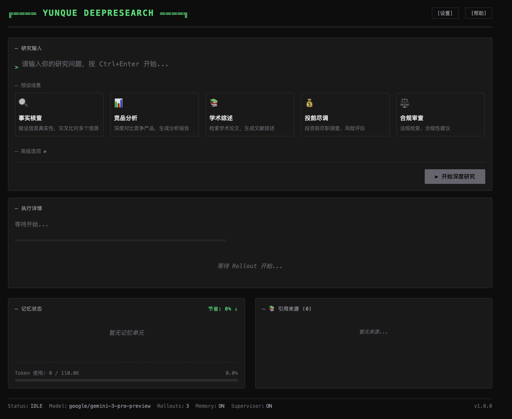
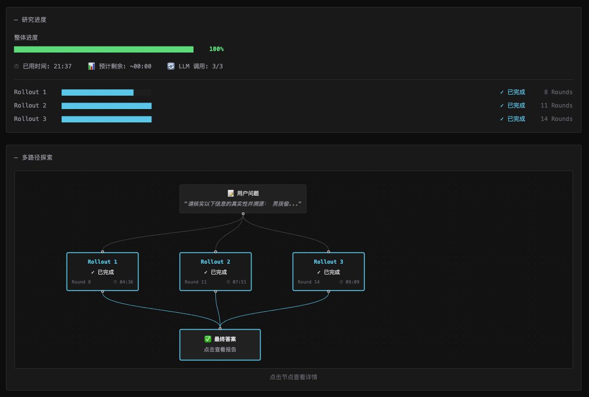

# Yunque DeepResearch

感谢[GMI Cloud](https://console.gmicloud.ai/)提供的算力支持

一款**多角色、多轮深度搜索与研究**的 Agent 助理，支持长链路推理、可视化进度追踪、记忆折叠与监督纠错，面向复杂问题的系统化信息收集与报告生成。

## 界面

<p align="center">
  
</p>

<p align="center">
  
</p>

## 快速开始

本指南包含环境配置、后端 API 启动与 UI 启动方式。

### 1. 环境准备

```bash
conda create -n hivemind python=3.10.0
conda activate hivemind
pip install -r requirements.txt
# OR No Cuda
pip install -r requirements_nocuda.txt
```

### 2. 配置环境变量

复制示例环境文件：

```bash
# Copy the example environment file
cp .env.example .env
```

编辑 `.env`，填写必要配置：

- **SERPER_KEY_ID**：Serper 搜索服务 Key（用于 Search / Scholar）。
- **JINA_API_KEYS**：Jina Key（用于网页读取）。
- **AGENT_API_KEY/AGENT_API_BASE**：OpenAI 兼容 API 的 Key/Base（主模型调用）。
- **SANDBOX_FUSION_ENDPOINT**：Python 解释器沙箱（可选）。
- **LLM_MODEL**：调用的模型名（需与服务端一致）。

### 3. 启动后端 API

```bash
conda activate hivemind
./api/run.sh
```

默认监听 `http://127.0.0.1:8000`，可通过 `.env` 的 `API_PORT` 修改端口。

### 4. 启动前端 UI

```bash
cd ui
npm install
npm run dev
```

浏览器打开 `http://localhost:5173`。

### 5. （可选）运行评测脚本

如需运行 `inference/` 下的评测脚本：

```bash
bash inference/run.sh
```

## 致谢

[Yunque-DeepResearch]https://github.com/Tencent-BAC/Yunque-DeepResearch
